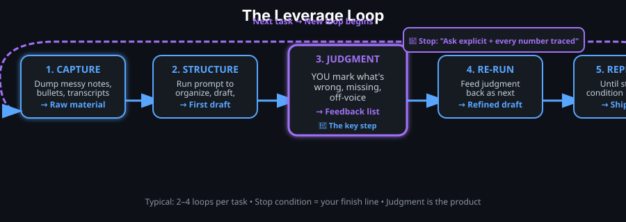
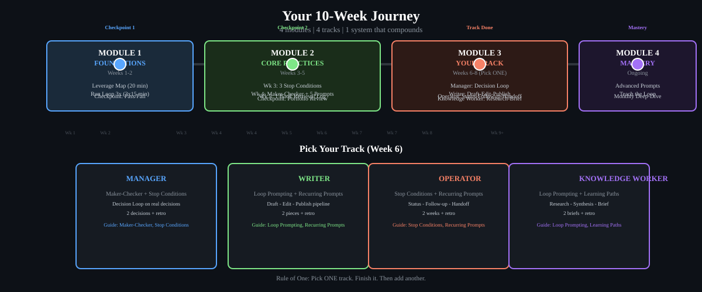
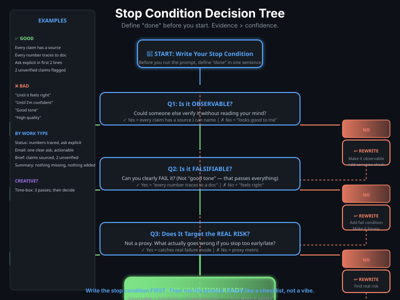

<p align="center">
  
</p>

<p align="center">
  <a href="docs/site/leverage-loop.html">
    
  </a>
</p>
<p align="center">
  <sub>Diagram: <a href="docs/site/leverage-loop.html">Read the Leverage Loop guide</a></sub>
</p>

<p align="center">
  <strong>Practical AI leverage for working professionals. Not engineers. Not hype.<br/>More leverage, not more AI.</strong>
</p>

<p align="center">
  <a href="https://github.com/thewyattbrocato/ai-leverage-field-guide/blob/main/LICENSE">
    
  </a>
  <a href="https://github.com/thewyattbrocato/ai-leverage-field-guide/actions/workflows/link-check.yml">
    
  </a>
  <a href="https://github.com/thewyattbrocato/ai-leverage-field-guide/stargazers">
    
  </a>
  <a href="https://github.com/thewyattbrocato/ai-leverage-field-guide/forks">
    
  </a>
</p>

---

## 🌐 Use the Interactive Field Guide

The guides are live as an interactive site — no install, no account, nothing leaves your browser:

| Start here | What you get |
|------------|--------------|
| [**Interactive home**](https://thewyattbrocato.github.io/ai-leverage-field-guide/) | Overview, role-based path picker, and where to begin |
| [**Leverage Loop**](https://thewyattbrocato.github.io/ai-leverage-field-guide/leverage-loop.html) | The core engine: Capture → Structure → Judgment → Re-run → Repeat, with a copy-ready correction prompt |
| [**10-Week Curriculum**](https://thewyattbrocato.github.io/ai-leverage-field-guide/curriculum.html) | Four modules plus local progress tracking (export/import included) |
| [**Stop Condition Builder**](https://thewyattbrocato.github.io/ai-leverage-field-guide/stop-conditions.html#stop-condition-builder) | Generate observable, falsifiable, real-risk stop conditions as Markdown |

> Everything interactive runs locally in your browser. Selections and progress remain in the current browser and are not transmitted. The same guides also ship as responsive, accessible HTML in [`docs/site`](docs/site/) — with skip links, `aria-current` navigation, keyboard-scrollable tables, and no horizontal overflow from 320 px up. They deploy via GitHub Pages once enabled (see below).

---

## 🗺️ The Complete Journey (4 Modules, 8–10 Weeks)

```
┌────────────────────────────────────────────────────────────────────────────────┐
│  MODULE 1: FOUNDATIONS (Weeks 1–2)                                              │
│  Mental Models → Capture/Structure/Judgment Loop → First Recurring Prompt      │
│  ✅ Outcome: Run the loop on a real task 3× this week. Saved prompt.           │
├────────────────────────────────────────────────────────────────────────────────┤
│  MODULE 2: CORE PRACTICES (Weeks 3–5)                                           │
│  Stop Conditions → Maker-Checker → Recurring Prompts → Learning Paths          │
│  ✅ Outcome: 3 stop-conditions, 1 checked artifact, 5-prompt library, 1 book  │
├────────────────────────────────────────────────────────────────────────────────┤
│  MODULE 3: YOUR TRACK (Weeks 6–8)                                               │
│  Manager / Writer / Operator / Knowledge Worker → 1 Project + 1 Retro         │
│  ✅ Outcome: A domain-specific leverage system you use every week.             │
├────────────────────────────────────────────────────────────────────────────────┤
│  MODULE 4: MASTERY & CONTINUATION (Ongoing)                                     │
│  Advanced prompts → Teach the loop → Leverage Library deep-dive → Community   │
│  ✅ Outcome: You're the one others come to for leverage.                       │
└────────────────────────────────────────────────────────────────────────────────┘
```

<p align="center">
  <a href="docs/site/curriculum.html">
    
  </a>
</p>
<p align="center">
  <sub>Diagram: <a href="docs/site/curriculum.html">Read the 10-Week Curriculum guide</a></sub>
</p>

**🎯 Time to working system: 4–6 weeks** | **🏆 Time to role mastery: 8–10 weeks**

---

## 🚀 Choose Your Path — Start Here

| Track | You Are… | First Guide | Outcome |
|-------|----------|-------------|---------|
| **[🎯 Manager](docs/guides/manager.md)** | Decide, prioritize, resource, report up | [Maker-Checker](docs/guides/maker-checker.md) | Decision loop on real decisions |
| **[✍️ Writer](docs/guides/writer.md)** | Draft, edit, publish, repurpose | [Loop Prompting](docs/guides/loop-prompting.md) | Draft→Edit→Publish pipeline |
| **[⚙️ Operator](docs/guides/operator.md)** | Status, follow-ups, handoffs, tickets | [Stop Conditions](docs/guides/stop-conditions.md) | Status→Follow-up→Handoff rhythm |
| **[🔍 Knowledge Worker](docs/guides/knowledge-worker.md)** | Research, synthesis, briefs, strategy | [Loop Prompting](docs/guides/loop-prompting.md) | Research→Synthesis→Brief pipeline |
| **[🎯 Generalist](docs/curriculum.md)** | Not sure / want the full foundation | [Loop Prompting](docs/guides/loop-prompting.md) | Complete 4-module curriculum |

> **Rule of One** — Pick ONE track. Finish it. Then add another. The lead guide carries most of the impact (*Great Leads*).

---

## 📚 Curriculum at a Glance

### Module 1: Foundations (Weeks 1–2)
| Step | Guide | Exercise | Deliverable |
|------|-------|----------|-------------|
| 1.1 | How This Works (5 min) | [Leverage Map](docs/exercises.md#exercise-11-leverage-map-20-minutes) | **Leverage Map** (1 page) |
| 1.2 | [Loop Prompting](docs/guides/loop-prompting.md) | [Run the Loop 3×](docs/exercises.md#exercise-12-run-the-loop-3-this-week) | **Saved Recurring Prompt** |
| **✅ Checkpoint** | | [Self-Assessment](docs/exercises.md#module-1-checkpoint-rubric) | **Pass/Fail + Notes** |

### Module 2: Core Practices (Weeks 3–5)
| Week | Guide | Exercise | Deliverable |
|------|-------|----------|-------------|
| 3 | [Stop Conditions](docs/guides/stop-conditions.md) | [3 Stop Conditions](docs/exercises.md#exercise-21-stop-condition-library-week-3) | **Stop-Condition Library** (3 entries) |
| 4 | [Maker-Checker](docs/guides/maker-checker.md) | [1 Checked Artifact](docs/exercises.md#exercise-22-maker-checker-run-week-4) | **Checked Artifact + Retro** |
| 4 | [Recurring Prompts](docs/guides/recurring-prompts.md) | [5-Prompt Library](docs/exercises.md#exercise-23-build-your-5-prompt-library-week-4) | **Prompt Library v1** |
| 5 | [Learning Paths](docs/guides/learning-paths.md) | [1 Book Retrieval Log](docs/exercises.md#exercise-24-retrieval-log-for-one-book-week-5) | **Retrieval Log + Summary** |
| **✅ Checkpoint** | | [Portfolio Review](docs/exercises.md#module-2-checkpoint-rubric) | **Pass/Fail + Next Focus** |

### Module 3: Your Track (Weeks 6–8) — Pick ONE
| Track | Guides | Project | Retro Question |
|-------|--------|---------|----------------|
| [Manager](docs/guides/manager.md) | Maker-Checker + Stop Conditions | Decision Loop on real decision | "What did the loop catch?" |
| [Writer](docs/guides/writer.md) | Loop Prompting + Recurring Prompts | Draft→Edit→Publish pipeline | "Which prompt saved time?" |
| [Operator](docs/guides/operator.md) | Stop Conditions + Recurring Prompts | Status→Follow-up→Handoff pipeline | "What dropped? What saved me?" |
| [Knowledge Worker](docs/guides/knowledge-worker.md) | Loop Prompting + Learning Paths | Research→Synthesis→Brief pipeline | "What prompt needs v2.0?" |

### Module 4: Mastery (Ongoing)
| Step | What You Do | Why It Compounds |
|------|-------------|------------------|
| Advanced Prompts | Build custom prompts for your domain | Your library becomes proprietary IP |
| Teach the Loop | Run Module 1 for a colleague | Teaching = highest-form retrieval (Feynman) |
| Monthly Deep-Dive | 1 theme/month from [Leverage Library](docs/library.md) | Compound the mental models behind the guides |
| Community | Share a prompt, review a peer's | Social accountability + new patterns |
| Contribute | Add a guide, fix a link, improve a template | The repo gets better; you own a piece |

---

## 📖 Leverage Library — The 10 Books to Start With

**Ranked by how directly they feed the "more leverage, not more AI" thesis.**

| # | Book | Why It Matters | Free Source |
|---|------|----------------|-------------|
| 1 | **Peak** (Ericsson & Pool) | Skills are built, not found; deliberate practice beats the 10,000-hour myth | Buy/borrow |
| 2 | **Make It Stick** (Brown, Roediger, McDaniel) | Retrieval & spacing are the most proven ways to retain what you learn | Buy/borrow |
| 3 | **AI Snake Oil** (Narayanan & Kapoor) | Clearest "what AI can/can't do" filter; kills hype fast | Buy/borrow |
| 4 | **Co-Intelligence** (Mollick) | Practical "human-in-the-loop" framing; 4 rules → copy-paste prompt principles | Buy/borrow |
| 5 | **Deep Work** (Newport) | Focus/leverage spine; pairs with *A World Without Email* | Buy/borrow |
| 6 | **The Scout Mindset** (Galef) | Soldier vs. scout for judgment checklists and stop conditions | Buy/borrow |
| 7 | **Crucial Conversations** (Grenny et al.) | Maker-checker & meeting follow-ups = "safety" operationalized | Buy/borrow |
| 8 | **The Mom Test** (Fitzpatrick) | Discovery discipline for research prep; **free cheatsheet** | [momtestbook.com](https://momtestbook.com) |
| 9 | **Scientific Advertising** (Hopkins, 1923) | **Public domain** — reason-why / test-and-measure doctrine | [archive.org](https://archive.org/details/scientificadvert0000hopk) |
| 10 | **Good Strategy / Bad Strategy** (Rumelt) | Diagnosis→policy→action kernel = backbone of stop conditions | Buy/borrow |

**Themes (go here when a specific job shows up):**

| Theme | Core Idea | Maps To |
|-------|-----------|---------|
| **A: Judgment over automation** | A prediction ≠ a decision; keep human in loop | [Stop Conditions](docs/guides/stop-conditions.md) |
| **B: Retrieval-based learning** | Retrieval + spacing + interleaving = skill that sticks | [Learning Paths](docs/guides/learning-paths.md) |
| **C: Less-for-more systems** | Eliminate low-leverage work; focus on the vital few | [Recurring Prompts](docs/guides/recurring-prompts.md) |
| **D: Point-first writing** | Lead with action; kill clutter; write for busy readers | [Recurring Prompts](docs/guides/recurring-prompts.md) |
| **E: High-stakes conversations** | Safety = mutual purpose + respect; radical candor | [Maker-Checker](docs/guides/maker-checker.md) |
| **F: Strategy as diagnosis** | Strategy begins with diagnosis, not goals; Rumelt's kernel | [Stop Conditions](docs/guides/stop-conditions.md) |
| **G: Messaging that sticks** | SUCCESs (Simple, Unexpected, Concrete, Credible, Emotional, Stories) | Future guides |
| **H: Discovery with real signals** | Validate with behavior/commitment, not opinions | [Stop Conditions](docs/guides/stop-conditions.md) |
| **I: Prompting craft** | Few-shot + RAG beat clever phrasing; grounding > rhetoric | [Loop Prompting](docs/guides/loop-prompting.md) |

> **Full catalog:** [Reading Catalog](docs/reading.md) — 188 books with categories, why-it-matters, legitimate sources (buy/borrow/free). No pirate links. Ever.

---

## 🏋️ Practice Ground — Exercises on YOUR Real Work

**Every exercise uses YOUR work from THIS week. No toy examples.**

| Exercise | Time | Guide | What You Build |
|----------|------|-------|----------------|
| [1.1 Leverage Map](docs/exercises.md#exercise-11-leverage-map-20-minutes) | 20 min | — | Your 3 highest-leverage weekly tasks |
| [1.2 Run the Loop 3×](docs/exercises.md#exercise-12-run-the-loop-3-this-week) | 3 × 15 min | [Loop Prompting](docs/guides/loop-prompting.md) | Saved recurring prompt + judgment log |
| [2.1 Stop-Condition Library](docs/exercises.md#exercise-21-stop-condition-library-week-3) | 30 min | [Stop Conditions](docs/guides/stop-conditions.md) | 3 observable/falsifiable stop conditions |
| [2.2 Maker-Checker Run](docs/exercises.md#exercise-22-maker-checker-run-week-4) | 30 min | [Maker-Checker](docs/guides/maker-checker.md) | Checked artifact + retro |
| [2.3 5-Prompt Library](docs/exercises.md#exercise-23-build-your-5-prompt-library-week-4) | 60 min | [Recurring Prompts](docs/guides/recurring-prompts.md) | Prompt Library v1 (Status, Follow-up, Brief, Decision, Prep) |
| [2.4 Retrieval Log](docs/exercises.md#exercise-24-retrieval-log-for-one-book-week-5) | 4 sessions | [Learning Paths](docs/guides/learning-paths.md) | Retrieval log + 1-paragraph summary |

> **All exercises → [exercises.md](docs/exercises.md)** — includes Module 3 track projects, Module 4 mastery exercises, self-assessment rubrics, printable quick-reference cards.

<p align="center">
  <a href="docs/site/stop-conditions.html">
    
  </a>
</p>
<p align="center">
  <sub>Diagram: <a href="docs/site/stop-conditions.html">Read the Stop Conditions guide</a></sub>
</p>

---

## 📖 The Original Guides (Reference + Exercise)

| Guide | Core Idea | Exercise |
|-------|-----------|----------|
| [Loop Prompting](docs/guides/loop-prompting.md) | Prompt = rep, not request. Capture→Structure→Judgment→Re-run. | [Run 3×](docs/exercises.md#exercise-12-run-the-loop-3-this-week) |
| [Stop Conditions](docs/guides/stop-conditions.md) | Define "done" before you start. Evidence > confidence. | [3 Conditions](docs/exercises.md#exercise-21-stop-condition-library-week-3) |
| [Maker-Checker](docs/guides/maker-checker.md) | Split drafting (machine) from checking (human). You judge. | [1 Run](docs/exercises.md#exercise-22-maker-checker-run-week-4) |
| [Recurring Prompts](docs/guides/recurring-prompts.md) | Build a personal prompt library. Leverage compounds. | [5 Prompts](docs/exercises.md#exercise-23-build-your-5-prompt-library-week-4) |
| [Learning Paths](docs/guides/learning-paths.md) | Retrieval + spacing + interleaving as prompt loops. | [1 Book](docs/exercises.md#exercise-24-retrieval-log-for-one-book-week-5) |
| [Manager Track](docs/guides/manager.md) | Decision loop on real decisions. | [2 Decisions](docs/guides/manager.md#the-project-weeks-6-8) |
| [Writer Track](docs/guides/writer.md) | Draft→Edit→Publish pipeline. | [2 Pieces](docs/guides/writer.md#the-project-weeks-6-8) |
| [Operator Track](docs/guides/operator.md) | Status→Follow-up→Handoff rhythm. | [2 Weeks](docs/guides/operator.md#the-project-weeks-6-8) |
| [Knowledge Worker Track](docs/guides/knowledge-worker.md) | Research→Synthesis→Brief pipeline. | [1 Brief](docs/guides/knowledge-worker.md#the-project-weeks-6-8) |

---

## 🛠️ Free Resources Hub

### 🎓 Free AI Courses (audit tracks, no paywalls)
- [Elements of AI](https://www.elementsofai.com/) — Friendliest "what AI actually is" for non-technical people
- [Google AI Essentials](https://www.coursera.org/learn/google-ai-essentials) — Practical everyday basics from Google
- [Generative AI for Everyone](https://www.deeplearning.ai/courses/generative-ai-for-everyone) — Andrew Ng, plain-English mental models
- [AI For Everyone](https://www.deeplearning.ai/courses/ai-for-everyone) — Andrew Ng, how AI fits organizations
- [Microsoft Generative AI for Beginners](https://github.com/microsoft/generative-ai-for-beginners) — 18-lesson MIT-licensed course
- [Microsoft AI for Beginners](https://github.com/microsoft/AI-For-Beginners) — 24-lesson curriculum on ML

### 🛠️ Free Tools with Real Free Tiers
| Tool | Best For |
|------|----------|
| [ChatGPT](https://chat.openai.com) | General chat, coding, analysis |
| [Claude](https://claude.ai) | Long documents, careful writing |
| [Gemini](https://gemini.google.com) | Deep Docs/Workspace integration |
| [Copilot](https://copilot.microsoft.com) | Web-grounded chat |
| [Perplexity](https://www.perplexity.ai) | Research with cited sources |
| [NotebookLM](https://notebooklm.google.com) | Ground chat in YOUR documents |
| [Obsidian](https://obsidian.md) | Free for personal use; prompt library home |

### 📚 Official Docs & Primary Sources
- [OpenAI Docs](https://platform.openai.com/docs) • [Anthropic Docs & Prompt Library](https://docs.anthropic.com)
- [Google AI/Gemini Docs](https://ai.google.dev) • [Microsoft AI Learn](https://learn.microsoft.com/ai/)
- [Prompt Engineering Guide (DAIR-ai)](https://www.promptingguide.ai/) • [Google Prompting Strategies](https://ai.google.dev/gemini-api/docs/prompting-strategies)

### 📖 Free Related Reading (Public Domain / Open Access)
- [Scientific Advertising (Hopkins, 1923)](https://archive.org/details/scientificadvert0000hopk) — **Public domain**, direct-response classic
- [Project Gutenberg](https://www.gutenberg.org/) — 70,000+ free books (*Art of War, The Prince, Meditations, Think and Grow Rich, Elements of Style, As a Man Thinketh*)
- [OpenStax](https://openstax.org/) — Free peer-reviewed textbooks (economics, business, stats)
- [MIT OpenCourseWare](https://ocw.mit.edu/) — Free course materials (management, communication, systems)
- [Paul Graham Essays](https://paulgraham.com/articles.html) — Free, sharp essays on startups, work, thinking

---

## ⚡ Hype vs. Real — Quick Filter

| ✅ Real | ❌ Hype |
|---------|---------|
| Specific, repeatable job you can do this week | "Revolutionize your workflow," "10x everything" |
| Free tier, no account needed to learn | Tool needs 40-min video to explain |
| You keep judgment in the loop | Machine makes the call, you just forward it |

**If a resource can't pass "what exactly will I do with this on Monday?", skip it.**

---

## 🤝 Contributing

Found a great *free* resource? See [CONTRIBUTING.md](CONTRIBUTING.md). Two hard rules:  
**no copyrighted uploads, no affiliate links.** All original content licensed [CC-BY-4.0](LICENSE).

---

## 📋 Quick Reference

| Resource | Purpose |
|----------|---------|
| [Start Here](docs/start-here.md) | 15-minute onboarding → first win today |
| [FAQ](docs/faq.md) | Top 10 stuck points + solutions |
| [Progress Tracker](docs/progress-tracker.md) | Copy-paste checkbox tracker for all modules |
| [Quick Reference Cards](docs/quick-reference/) | Printable cards for loop, stop conditions, maker-checker, retrieval |

---

## 📬 Stay in the Loop

- **GitHub:** [Star this repo](https://github.com/thewyattbrocato/ai-leverage-field-guide) → updates in your feed
- **Newsletter:** [wyattbrocato.site](https://wyattbrocato.site) — weekly leverage notes
- **X:** [@thewyattbrocato](https://x.com/thewyattbrocato) — daily threads
- **LinkedIn:** [/in/wyattbrocato](https://www.linkedin.com/in/wyattbrocato/) — weekly posts

---

*Built from a private library of 200+ books on learning science, product, copywriting, leadership, and AI. Every idea attributed. No books uploaded. No pirate links. The reading sheet is the public proof — chase any source yourself.*